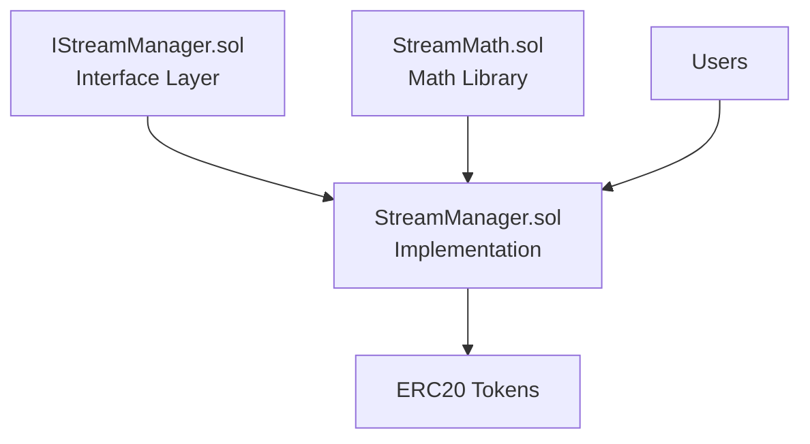

# HyperStream Smart Contracts Documentation

This document provides a comprehensive overview of all Solidity files in the HyperStream payment streaming protocol.

---

## Architecture Overview

HyperStream uses a **pull-based linear streaming model** optimized for Monad's Optimistic Concurrency Control (OCC). The architecture separates concerns into three layers:



---

## Core Contracts

### 1. `contracts/interfaces/IStreamManager.sol`

**Purpose**: Defines the strict ABI (Application Binary Interface) for the StreamManager contract.

**Key Components**:

#### Structs
```solidity
struct Stream {
    address sender;          // Who funded the stream
    address recipient;       // Who receives the tokens
    uint256 deposit;         // Total tokens deposited
    address tokenAddress;    // ERC20 token being streamed
    uint256 startTime;       // When streaming begins (unix timestamp)
    uint256 stopTime;        // When streaming ends (unix timestamp)
    uint256 ratePerSecond;   // Tokens unlocked per second
    uint256 remainingBalance; // Tokens still locked in the stream
}
```

#### Custom Errors
| Error | Triggered When |
|---|---|
| `ZeroAddress()` | Zero address provided for recipient/token |
| `InvalidTimeFrame()` | Start time invalid (past or ≥ stop time) |
| `ZeroDeposit()` | Deposit amount is zero |
| `StreamDoesNotExist(uint256)` | Querying non-existent stream ID |
| `UnauthorizedCaller(address)` | Caller not authorized for action |
| `ArithmeticOverflow()` | Math operation overflow or withdraw > balance |

#### Events
| Event | Description |
|---|---|
| `StreamCreated` | Emitted when a new stream is created |
| `WithdrawFromStream` | Emitted when recipient withdraws tokens |
| `StreamCanceled` | Emitted when stream is canceled by sender/recipient |

#### Functions
- `createStream()`: Create a new payment stream
- `balanceOf()`: Query real-time balance for sender or recipient
- `withdrawFromStream()`: Recipient withdraws earned tokens
- `cancelStream()`: Cancel stream and distribute remaining funds
- `getStream()`: Retrieve full stream details

---

### 2. `contracts/libraries/StreamMath.sol`

**Purpose**: Pure/stateless library containing all precision-critical streaming calculations.

**Design Philosophy**: 
- All functions are `internal pure` → inline at compile time (zero overhead)
- Prevents silent precision loss by requiring exact divisibility
- Isolates complex math from main contract for security and readability

**Key Functions**:

#### `ratePerSecond(deposit, duration) → rate`
Computes the per-second streaming rate. **Reverts** if `deposit % duration ≠ 0` to prevent precision loss.

```solidity
rate = deposit / duration;
require(rate * duration == deposit); // Exact divisibility check
```

#### `deltaOf(currentTime, startTime, stopTime) → delta`
Computes elapsed time clamped to the stream window `[startTime, stopTime]`.

- Before start: returns `0`
- After end: returns `stopTime - startTime`
- During stream: returns `currentTime - startTime`

#### `streamedAmount(deposit, currentTime, ...) → earned`
Computes total tokens earned by recipient up to `currentTime`:

```
earned = min(delta × ratePerSecond, deposit)
```

#### `recipientBalance(deposit, remainingBalance, ...) → balance`
Withdrawable amount for recipient:

```
balance = earned - alreadyWithdrawn
```

#### `senderBalance(deposit, remainingBalance, ...) → balance`
Reclaimable amount for sender upon cancellation:

```
balance = remainingBalance - recipientWithdrawable
```

---

### 3. `contracts/StreamManager.sol`

**Purpose**: Singleton contract managing the global stream registry and state transitions.

**Security Features**:
- ✅ `ReentrancyGuard`: Prevents reentrancy attacks on withdraw/cancel
- ✅ `SafeERC20`: Protects against non-standard ERC20 implementations
- ✅ **CEI Pattern** (Checks-Effects-Interactions): Updates state before external calls
- ✅ **Storage cleanup**: Deletes streams when fully drained → gas refund

**State Variables**:
```solidity
uint256 public nextStreamId;              // Auto-incrementing counter (starts at 1)
mapping(uint256 => Stream) private _streams; // Stream ID → Stream data
```

**Core Functions**:

#### `createStream(recipient, deposit, tokenAddress, startTime, stopTime)`
1. **Validates** inputs (non-zero addresses, future start time, deposit > 0)
2. **Computes** exact `ratePerSecond` using `StreamMath`
3. **Stores** new stream in `_streams` mapping
4. **Transfers** `deposit` tokens from sender to contract via `safeTransferFrom`
5. **Emits** `StreamCreated` event
6. **Returns** unique `streamId`

#### `withdrawFromStream(streamId, amount)`
1. **Verifies** caller is recipient
2. **Computes** available balance using `StreamMath.recipientBalance`
3. **Checks** amount > 0 and amount ≤ available
4. **Updates** `remainingBalance` (CEI pattern)
5. **Deletes** stream if fully drained (gas refund)
6. **Transfers** tokens to recipient
7. **Emits** `WithdrawFromStream` event

**Optimization**: When `remainingBalance` reaches 0, the stream is deleted to refund storage costs (~15k gas).

#### `cancelStream(streamId)`
1. **Verifies** caller is sender OR recipient
2. **Computes** split: `recipientBalance` (earned) vs `senderBalance` (unearned)
3. **Deletes** stream (CEI pattern)
4. **Transfers** earned tokens to recipient
5. **Transfers** unearned tokens back to sender
6. **Emits** `StreamCanceled` event

#### `balanceOf(streamId, who)`
View function returning real-time balance for `who` (sender or recipient).

#### `getStream(streamId)`
View function returning full `Stream` struct.

---

## Testing & Deployment

### 4. `contracts/test/StreamManager.t.sol`

**Purpose**: Comprehensive Foundry test suite with 24 tests.

**Test Categories**:

| Category | Tests | Coverage |
|---|---|---|
| **State Transitions** | `test_CreateStream`, `test_MultipleStreamIds` | Event emission, state updates, ERC20 transfers |
| **Revert Conditions** | 9× `test_RevertIf_*` | All custom error paths (ZeroAddress, InvalidTimeFrame, etc.) |
| **Time Manipulation** | `test_WithdrawHalfway`, `test_CancelStream`, etc. | Uses `vm.warp` to test balances at different time points |
| **Stateless Fuzzing** | 4× `testFuzz_*` | Invariant testing (unlocked ≤ deposit, balance sums, rate precision) |

**Key Test Helpers**:
- `setUp()`: Deploys contracts, creates test actors (Alice/Bob), mints tokens
- `_createDefaultStream()`: Creates a standard 1-hour stream for testing
- Uses OpenZeppelin's `ERC20Mock` for token simulation

**Fuzz Tests** validate critical invariants across 256 random inputs:
- Unlocked amount never exceeds deposit
- Sender + recipient balances always equal remaining balance
- Rate × duration always equals deposit (no precision loss)
- Time delta always clamped to `[0, duration]`

---

### 5. `contracts/script/DeployStreamManager.s.sol`

**Purpose**: Foundry deployment script for Monad testnet/mainnet.

**Usage**:
```bash
# Dry-run (simulation)
forge script contracts/script/DeployStreamManager.s.sol --rpc-url $RPC_URL

# Deploy to Monad
forge script contracts/script/DeployStreamManager.s.sol \
  --rpc-url $RPC_URL \
  --private-key $PRIVATE_KEY \
  --broadcast
```

**Deployment Flow**:
1. Reads `PRIVATE_KEY` from env (or uses `msg.sender`)
2. Logs deployer address and chain ID
3. Deploys `StreamManager` singleton with `new StreamManager()`
4. Logs deployed contract address
5. Verifies `nextStreamId == 1`

**Output Example**:
```
=== HyperStream Deployment ===
Deployer: 0xB2bF6fa34580AF4641f6ff5A4804De85F8204450
Chain ID: 10143
---
StreamManager deployed at: 0xd210d75702836ea5c13457d064045f39d253A235
Next stream ID: 1
```

---

## Mathematical Model

The core streaming formula is:

```
Balance(t) = min(deposit, (t - startTime) × ratePerSecond)
```

Where:
- `t` = current block timestamp
- `ratePerSecond = deposit / (stopTime - startTime)`

This ensures:
- ✅ **Linear unlocking**: Tokens unlock at a constant rate
- ✅ **No money creation**: Total unlocked never exceeds deposit
- ✅ **Precision safety**: Rejects deposits that don't divide evenly

**Example**:
```
Deposit:    3600 tokens
Duration:   1 hour (3600 seconds)
Rate:       1 token/second

At t=1800s (30min): Balance = 1800 tokens (50%)
At t=3600s (1hr):   Balance = 3600 tokens (100%)
At t=7200s (2hr):   Balance = 3600 tokens (capped)
```

---

## Gas Optimizations

| Optimization | Savings | Implementation |
|---|---|---|
| **Storage deletion** | ~15k gas | `delete _streams[id]` when drained |
| **Inline library** | ~2k gas/call | `StreamMath` uses `internal pure` |
| **Unchecked arithmetic** | ~100 gas | Safe subtraction in balance updates |
| **Single storage read** | ~2k gas | Load `Stream` into memory once |

---

## Security Considerations

### ✅ Implemented Protections
- **Reentrancy Guard**: Prevents recursive withdrawals/cancellations
- **SafeERC20**: Handles non-standard ERC20 tokens (no return value, etc.)
- **CEI Pattern**: Updates state before external calls
- **Input validation**: All zero addresses, invalid time frames caught
- **Precision checks**: Reverts if `deposit % duration ≠ 0`

### 🔍 Audit Recommendations
- Use a time-locked multisig for contract ownership (if adding admin functions)
- Consider pausable mechanism for emergency stops
- Test with various ERC20 tokens (USDT, USDC, etc.)
- Verify behavior with tokens that charge transfer fees

---

## Deployment Details

**Monad Testnet**:
- Contract: `0xd210d75702836ea5c13457d064045f39d253A235`
- Deployer: `0xB2bF6fa34580AF4641f6ff5A4804De85F8204450`
- Chain ID: `10143`
- Tx Hash: `0xcd85afe907ed6f3768c55bbd8a8451eee04ae39c57971ca567bef1b845d3fc24`
- Gas Used: 2,081,955 gas @ 103 gwei

---

## Integration Example

```javascript
// Frontend integration with Wagmi/Viem
import StreamManagerABI from './out/StreamManager.sol/StreamManager.json';

const { write } = useContractWrite({
  address: '0xd210d75702836ea5c13457d064045f39d253A235',
  abi: StreamManagerABI.abi,
  functionName: 'createStream',
});

// Create a 1-month salary stream
await write({
  args: [
    recipientAddress,
    parseEther('5000'), // 5000 USDC
    usdcTokenAddress,
    startTime,
    startTime + 30 * 24 * 3600, // +30 days
  ],
});
```

---

## File Summary

| File | Lines | Purpose |
|---|---|---|
| `IStreamManager.sol` | 150 | Interface + ABI definition |
| `StreamMath.sol` | 114 | Pure math library |
| `StreamManager.sol` | 254 | Main implementation |
| `StreamManager.t.sol` | 644 | Test suite (24 tests) |
| `DeployStreamManager.s.sol` | 52 | Deployment script |
| **Total** | **1,214** | Full protocol implementation |

---

**Built for Monad Hackathon** | Optimized for OCC | Pull-based streaming protocol
